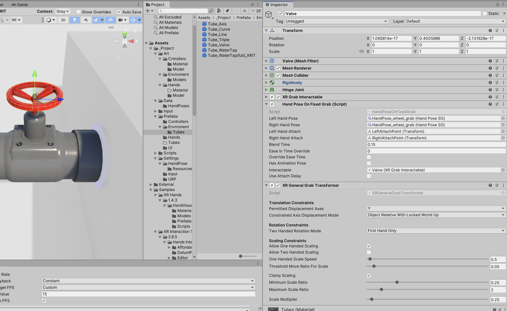
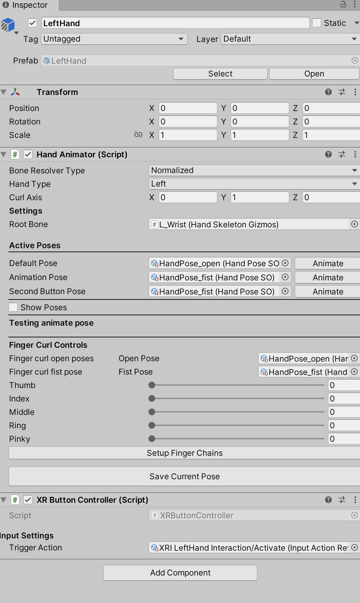
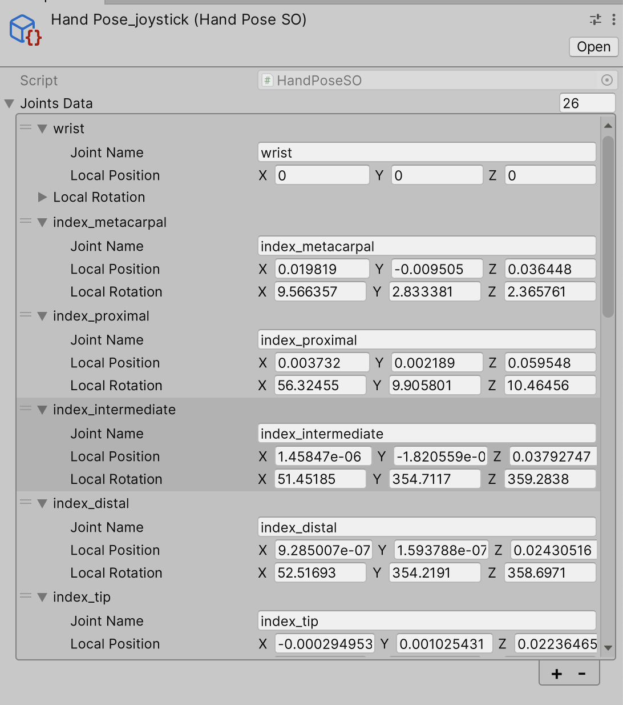
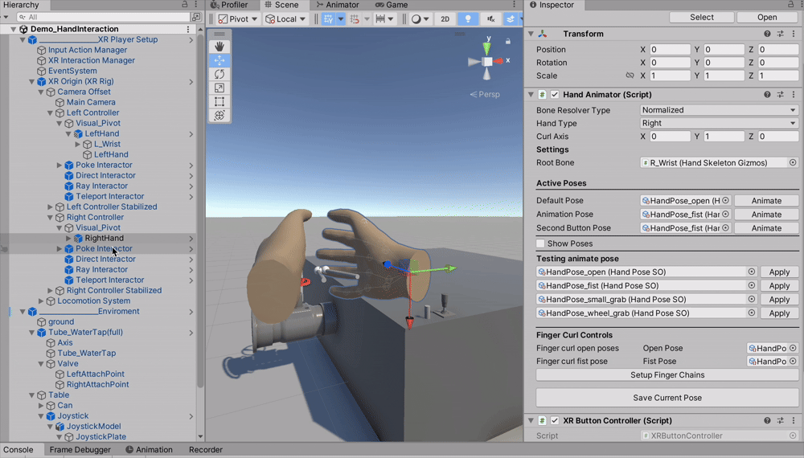
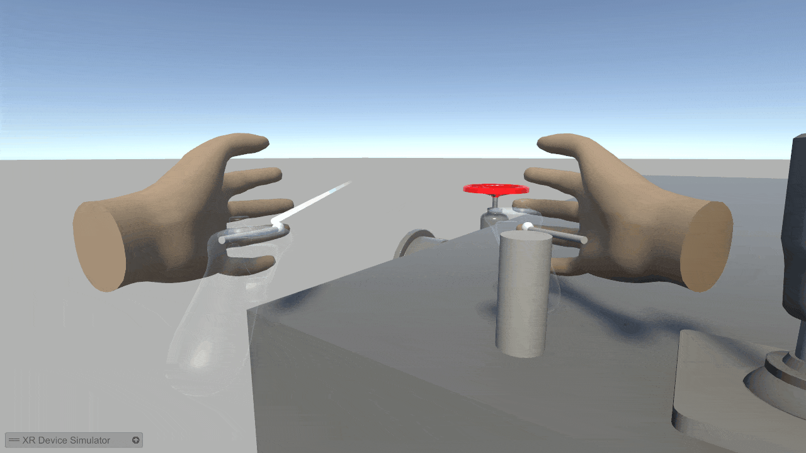
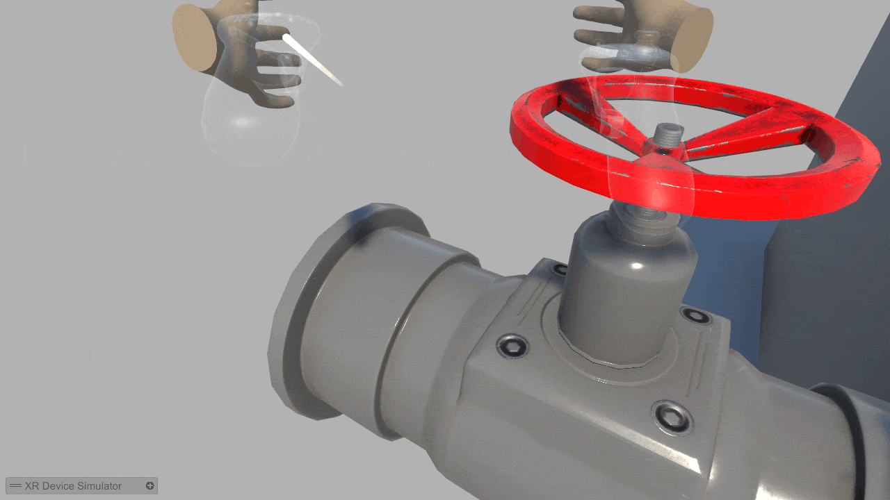

# Hand Interaction System - VR Training Demo

A hand interaction system for Unity XR showcasing runtime pose blending, procedural finger animation, and flexible bone resolver architecture.

[🎥 Jump to Interaction Gallery & Screenshots](#-interaction-gallery)

---

## 🎯 Core Features

### ✨ Runtime Hand Animation
- **Pose-based blending system** - Smooth transitions between pre-authored hand poses
- **ScriptableObject data pipeline** - Artist-friendly workflow for pose authoring
- **Procedural finger curl** - Real-time finger animation driven by controller input (0-1 curl values)
- **Custom editor tooling** - In-editor pose capture and preview system

### 🔧 Technical Highlights
- **Regex-based bone name normalization** - Automatic normalization of bone hierarchies from different hand models
- **Cross-model compatibility** - Works with custom rigs and XR Hands canonical models
- **Hand mirroring system** - Single left-hand pose automatically mirrors to right hand
- **Event-driven architecture** - Clean separation between animation, interaction, and input layers

### 🎮 VR Interaction Integration
- **XR Interaction Toolkit integration** - Seamless integration with Unity's XR framework
- **Multi-hand grab support** - Simultaneous two-handed interactions
- **Dynamic hand detachment** - Hands detach from controllers and follow grabbed objects
- **Attach point system** - Precise hand placement on interactable objects

---

### 📋 Designed For

Functional for common VR training scenarios: equipment operation, valves, and tool handling.

---

## 🏗️ Architecture Overview
```
HandPoseManager (Core Hub)
├── IGrabModule (Modular Behaviors)
│   ├── SimpleGrabModule (Standard items: cans, tools)
│   └── FixedSnapModule (Fixed objects: wheels, levers)
├── XRHandAwareGrabInteractable (XRIT Provider)
│   └── Logic for L/R attach points & Snap modes
└── HandAnimator (Execution Layer)
```

---

## 🔑 Key Technical Solutions

### 1. Canonical Bone Naming System
Automatically normalizes bone names from different hand models using regex patterns:

```
Input variations:
- "L_Index_01_Jnt"
- "Left_Index_Proximal"  
- "LeftIndexProximal"
- "Index1"

↓ Normalized to ↓

"index_proximal"
```

**Benefits:**
- Single pose works across multiple hand models
- No manual remapping required
- Supports custom rigs and standard models (XR Hands, MetaHuman, etc.)

**Implementation:** Uses regex-based parsing to strip prefixes/suffixes and convert digit notation to semantic names (e.g., "1" → "proximal").

### 2. Procedural Finger Curl
Runtime finger animation without pre-authored poses:
```csharp
// Define open and fist reference poses
public HandPoseSO openPose;
public HandPoseSO fistPose;

// Each finger has independent curl control (0 = open, 1 = fist)
fingerChains[i].curlValue = triggerInput; // From XR controller

// Interpolate between reference poses per-bone
ApplyFingerCurl(fingerChain);
```

**Use case:** Dynamic hand reactions to controller input (trigger squeeze = gradual fist)

### 3. Automatic Hand Mirroring
Left-hand poses automatically flip to right hand:

```csharp
public JointTransformData MirrorJoint(Vector3 localPos, Quaternion localRot, string boneName)
{
    Vector3 mirroredPos = new Vector3(-localPos.x, localPos.y, localPos.z);
    Vector3 euler = localRot.eulerAngles;
    Quaternion mirroredRot = Quaternion.Euler(euler.x, -euler.y, -euler.z);
    return new JointTransformData { pos = mirroredPos, rot = mirroredRot };
}
```


**Benefit:** Artists author half the poses, system guarantees symmetry

---

## 🚀 Quick Start
### Setup (Inspector-based)
1. **For standard items**: Use `XRHandAwareGrabInteractable` (Snap Enabled) + `SimpleGrabModule`.
2. **For machinery (wheels/levers)**: Use `XRHandAwareGrabInteractable` (Snap Disabled) + `FixedSnapModule`.
3. **Assign Attach Points**: Set your transforms in the component's inspector. The custom editor will handle the rest.

**No scripting required** - All configuration via Unity Inspector

---

### Create Poses in Editor
1. Select hand model with HandAnimator in hierarchy
2. Click "Setup Finger Chains" button
2. Manually pose bones in scene view using fingers curls
3. Click "Save Current Pose" button
4. Pose saved as reusable ScriptableObject asset

---

### Apply at Runtime (Optional)

For programmatic control:

```csharp
// Instant pose change
handAnimator.AnimateInstantly(grabPose);

// Smooth blending
handAnimator.BeginNewPoses(primaryPose: grabPose, animPose: null);

// Procedural curl
fingerChain.curlValue = 0.8f; // 80% fist
handAnimator.ApplyFingerCurl(fingerChain);
```

---

## 🎨 Editor Features

### Pose Authoring Workflow
- **Visual pose editing** - Manipulate bones directly in scene view
- **One-click pose capture** - Saves all bone transforms to ScriptableObject
- **Instant preview** - Test poses without entering play mode
- **Finger curl sliders** - Real-time procedural animation preview

### Bone Resolver Configuration
- **Exact matching** - Direct name comparison (fast, strict)
- **Normalized matching** - Regex-based canonicalization (flexible, cross-model)

---

## 📦 Project Setup

### Dependencies
- Unity 2022.3 LTS or later
- XR Interaction Toolkit 2.6.5+
- Universal Render Pipeline (URP)

**Note:** XRIT sample assets included for input bindings and XR Origin rig setup.

---

## ⚡ Performance Characteristics

- **Transform-based animation** - No Animator overhead, direct bone manipulation
- **Cached lookups** - Dictionary-based bone resolution (O(1) access)
- **Minimal allocations** - Coroutine reuse, lookup tables initialized once
- **Smooth hand tracking** - LateUpdate timing for stable object following

---

## 🛠️ Advanced Configuration

### Custom Bone Resolver
Implement `IBoneResolver` for custom naming conventions:
```csharp
public class MyCustomResolver : IBoneResolver
{
    public void Initialize(IReadOnlyDictionary<string, Transform> boneCache) { }
    
    public Transform Resolve(string jointName)
    {
        // Custom matching logic
        return matchedBone;
    }
    
    public string GetCanonicalName(string rawName)
    {
        // Normalization logic
        return canonicalName;
    }
}
```

---

## 🔮 Future Enhancements

### Planned Features
- [ ] **XR Hand Tracking integration** - Controller-free hand tracking (Quest 3)
- [ ] **Curl-driven animation** - Automatic pose generation from controller input
- [ ] **IK constraints** - Physics-based finger collision avoidance
- [ ] **Networked hand sync** - Multiplayer hand animation replication
- [ ] **Animation curve support** - Non-linear pose blending

### Extensibility
System designed with provider pattern for future animation sources:
- `PoseBasedProvider` (current implementation)
- `CurlBasedProvider` (planned - procedural from input)
- `HandTrackingProvider` (planned - XR Hands integration)

---


## 🛠 Project Status
Development repository for a VR hand interaction system.
- **Current state:** Functional demo for grabbing objects and interacting with fixed machinery (wheels, levers).
- **Core:** Modular system using ScriptableObjects and custom Editor tools.

For commercial integration or custom development, contact: aleksey.zernovv@gmail.com

---

## 📝 Modular
✅ **Decoupled Logic** — Interaction types are separated into modules.
✅ **Editor Tooling** — Custom inspectors for easier object setup.
✅ **Performance** — No Animator overhead, direct bone manipulation.
---

## 📄 License

This is a portfolio demonstration project.

The code is provided for viewing and educational reference only.

**Permissions:**
- View the source code
- Use code snippets for learning purposes with attribution
- Running and compiling the project for evaluation purposes

**Restrictions:**
- No commercial use
- No redistribution
- No derivative works without written permission

For licensing inquiries, contact: aleksey.zernovv@gmail.com

---

## 👤 Contact

**Developer:** Aleksey Zernov  
**Email:** aleksey.zernovv@gmail.com  
**Telegram:** [@AlekseySZ](https://t.me/AlekseySZ)  
**LinkedIn:** [linkedin.com/in/aleksey-zernov-86145b191](https://www.linkedin.com/in/aleksey-zernov-86145b191)

**Specialization:** VR/XR interaction systems, procedural animation, Unity editor tooling

Interested in VR training applications, hand tracking systems, and technical art pipelines.

---
## 📸 Screenshots

| Pose Authoring Workflow | Intuitive Hand Editor |
| :---: | :---: |
|  |  |
| *Visual setup for complex objects like valves* | *Finger curl sliders for precise pose tuning* |

| Data-Driven Poses | One-Click Bone Resolver |
| :---: | :---: |
|  |  |
| *Poses saved as reusable ScriptableObjects* | *Automatic bone mapping via "Setup" button* |

---

## 🎬 Interaction Gallery

| Procedural Finger Curls | Joystick Physics (Configurable Joint) | Valve Interaction (Hinge Joint) |
| :---: |:-------------------------------------:| :---: |
|  |    |  |
| *Real-time input tracking* |    *Physics-based lever movement*     | *Two-handed rotation* |

---
## 🛠 Key Features

* **One-Click Setup**: The Bone Resolver automatically parses the hand hierarchy and maps finger chains. No manual bone assignment required.
* **Visual Authoring**: Create complex hand poses directly in the Scene View using intuitive sliders and transform handles.
* **SO-Based System**: Save and swap hand poses using `HandPoseSO` assets for modular and scalable development.
* **Physics-Based Interaction**: Robust support for Hinge and Configurable joints (levers, wheels, doors) with VR-optimized velocity tracking.

---

**⭐ If you find this relevant for your VR training project, let's connect!**